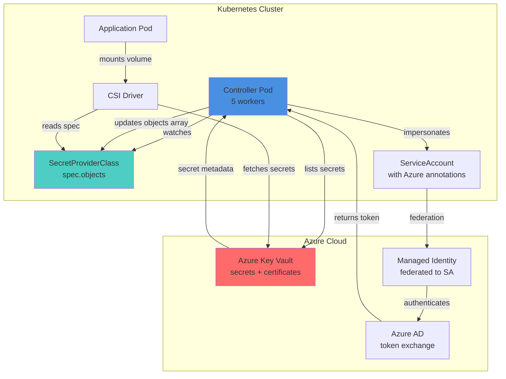
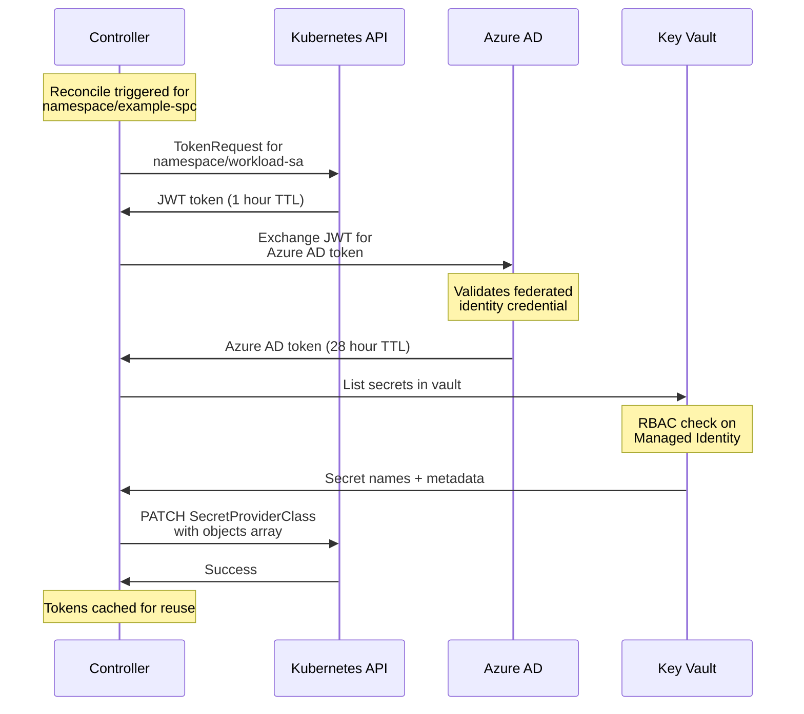
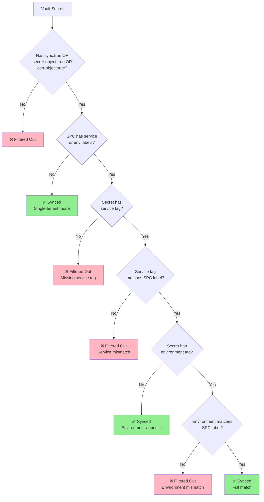

# Azure Key Vault Sync Controller

Manages SecretProviderClass resources based on Azure Key Vault tags instead of static YAML configuration. The vault becomes the source of truth for which secrets should be synced and how they should be exposed in Kubernetes.

Built for environments using Azure Key Vault with the Secrets Store CSI Driver.

## Who Should Use This

**Primary Audience:**
- **Platform Engineers** managing Kubernetes infrastructure with multiple services
- **DevOps Teams** responsible for secret rotation and Azure Key Vault integration
- **Security Engineers** enforcing zero-trust secret management patterns

**Prerequisites Knowledge:**
- Intermediate Kubernetes (understand CRDs, ServiceAccounts, RBAC)
- Basic Azure concepts (Managed Identity, RBAC, Key Vault)
- Familiarity with CSI drivers and secret management patterns

**Not Suitable For:**
- Teams not using Azure Key Vault
- Projects without existing Secrets Store CSI Driver infrastructure
- Organizations requiring GitOps-only secret management (consider External Secrets Operator or Sealed Secrets instead)

## Overview

This controller watches SecretProviderClass resources and automatically:
- Discovers secrets and certificates in Azure Key Vault
- Updates the `objects` array to match vault contents
- Optionally generates `secretObjects` for automatic Kubernetes Secret creation (via vault tags)
- Supports tag-based filtering for service and environment separation
- Handles permission errors gracefully with retry logic
- Provides immediate event-driven reconciliation

**Key Feature:** Azure Key Vault is the single source of truth - vault tags control all behavior including filtering and secret generation.

## When to Use This Controller

This controller is designed for teams using the [Azure Key Vault Provider for Secrets Store CSI Driver](https://learn.microsoft.com/en-us/azure/aks/csi-secrets-store-driver) who want to eliminate manual configuration management.

### The Problem This Solves

When using the Secrets Store CSI Driver with Azure Key Vault, you must manually maintain the `objects` array in your SecretProviderClass:

```yaml
spec:
  parameters:
    objects: |
      array:
        - objectName: "database-password"    # Must manually list every secret
          objectType: "secret"
        - objectName: "api-key"              # Must manually list every secret
          objectType: "secret"
        - objectName: "tls-cert"             # Must manually list every certificate
          objectType: "cert"
```

**Challenges:**
- 🔄 Must update YAML every time secrets change in vault
- ⚠️ Easy to forget secrets, causing application failures
- 📝 Manual synchronization between vault and Kubernetes
- 🔁 Repetitive updates across multiple environments

### The Solution

This controller **automatically discovers** vault contents and keeps SecretProviderClass synchronized:

```yaml
spec:
  parameters:
    objects: ""  # Controller populates this automatically!
```

The controller:
1. Authenticates to Azure Key Vault using Workload Identity
2. Lists all enabled secrets and certificates
3. Automatically updates the `objects` array
4. Optionally generates `secretObjects` for Kubernetes Secrets

**Result:** Your vault becomes the single source of truth. Add/remove secrets in Azure, and the controller updates Kubernetes automatically.

## Alternatives Comparison

| Approach | Manual YAML | External Secrets Operator | Azure Key Vault Controller (This) |
|----------|-------------|---------------------------|----------------------------------|
| **Setup Complexity** | Low | Medium | Medium |
| **Ongoing Maintenance** | High (every secret change) | Low | Low |
| **Vendor Lock-in** | None | Low (supports multi-cloud) | High (Azure only) |
| **Secret Access Pattern** | CSI volume mount | K8s Secret creation | CSI volume mount |
| **Azure Integration** | Native | Requires CRDs | Native (reuses Workload Identity) |
| **Audit Trail** | Kubernetes only | External Secrets + K8s | Azure Key Vault audit logs |
| **Best For** | < 10 secrets, simple setup | Multi-cloud, GitOps workflows | Azure-native, CSI Driver users |

**When to choose this controller:**
- ✅ Already using Azure Secrets Store CSI Driver
- ✅ Want vault as source of truth (not GitOps)
- ✅ Need Azure audit trail for compliance
- ❌ Require multi-cloud secret management → Use External Secrets Operator
- ❌ Want GitOps-driven secrets → Use Sealed Secrets or SOPS

### Prerequisites

You must have the Azure Secrets Store CSI Driver infrastructure already set up:

**Required Azure Documentation:**
- [Use the Azure Key Vault Provider for Secrets Store CSI Driver in AKS](https://learn.microsoft.com/en-us/azure/aks/csi-secrets-store-driver)
- [Use Azure Workload Identity with AKS](https://learn.microsoft.com/en-us/azure/aks/workload-identity-overview)
- [Provide an identity to access Azure Key Vault](https://learn.microsoft.com/en-us/azure/aks/csi-secrets-store-identity-access)

**What You Need:**
- ✅ Secrets Store CSI Driver installed in your cluster
- ✅ Azure Workload Identity enabled
- ✅ Managed Identity with Key Vault permissions (Get Secrets, List Secrets, Get Certificates, List Certificates)
- ✅ Federated Identity Credential linking Kubernetes ServiceAccount to Managed Identity

**What This Controller Adds:**
- 🤖 Automatic vault content discovery
- 🔄 Continuous synchronization of SecretProviderClass objects
- 🎯 Zero-touch configuration management

### Related Documentation

- **Azure Key Vault Provider:** https://azure.github.io/secrets-store-csi-driver-provider-azure/
- **Secrets Store CSI Driver:** https://secrets-store-csi-driver.sigs.k8s.io/
- **Azure Workload Identity:** https://azure.github.io/azure-workload-identity/

## Quick Start

Get the controller running in 4 steps:

### Step 1: Verify Prerequisites

Before installing, ensure your cluster meets these requirements:

```bash
# Check CSI Driver is installed
kubectl get csidriver secrets-store.csi.k8s.io
# Should return: secrets-store.csi.k8s.io

# Check Azure Workload Identity webhook is installed
kubectl get mutatingwebhookconfiguration azure-wi-webhook-mutating-webhook-configuration
# Should return the webhook configuration

# Check Azure Workload Identity webhook pods are running
kubectl get pods -n azure-workload-identity-system
# Should show running webhook pods

# Verify you have access to your Azure Key Vault
az keyvault show --name <your-vault-name>
```

**Required Azure Setup:**
- ✅ Secrets Store CSI Driver installed in cluster ([install guide](https://secrets-store-csi-driver.sigs.k8s.io/getting-started/installation.html))
- ✅ Azure Workload Identity enabled ([install guide](https://azure.github.io/azure-workload-identity/docs/installation.html))
- ✅ Azure Key Vault with secrets/certificates
- ✅ Managed Identity with Key Vault RBAC permissions (Get Secrets, List Secrets, Get Certificates, List Certificates)
- ✅ Federated Identity Credential linking Kubernetes ServiceAccount to Managed Identity

### Step 2: Choose Deployment Model

| Model | Use When | Security Posture |
|-------|----------|------------------|
| **Namespace-Scoped** | Production, multi-tenant clusters | ✅ **Recommended** - 90% privilege reduction |
| **Cluster-Wide** | Dev clusters, single tenant | ⚠️ Higher blast radius |

<details>
<summary><b>Deploy Namespace-Scoped (Recommended for Production)</b></summary>

```bash
# Set your target namespace
export NAMESPACE=production

# Create namespace if it doesn't exist
kubectl create namespace $NAMESPACE

# Deploy controller with namespace-limited RBAC
kubectl apply -f https://raw.githubusercontent.com/jeanhaley32/azure-keyvault-sync-controller/main/deploy/rbac-namespaced.yaml
kubectl apply -f https://raw.githubusercontent.com/jeanhaley32/azure-keyvault-sync-controller/main/deploy/deployment-namespaced.yaml

# Verify controller is running
kubectl get pods -n $NAMESPACE -l app=azure-keyvault-sync-controller
```

See [examples/namespace-scoped/](examples/namespace-scoped/) for detailed deployment instructions.

</details>

<details>
<summary><b>Deploy Cluster-Wide (Simple)</b></summary>

```bash
# Deploy controller with cluster-wide permissions
kubectl apply -f https://raw.githubusercontent.com/jeanhaley32/azure-keyvault-sync-controller/main/deploy/rbac.yaml
kubectl apply -f https://raw.githubusercontent.com/jeanhaley32/azure-keyvault-sync-controller/main/deploy/deployment.yaml

# Verify controller is running
kubectl get pods -n kube-system -l app=azure-keyvault-sync-controller
```

</details>

### Step 3: Create Your First Managed SecretProviderClass

Create a SecretProviderClass with the automatic sync annotation:

```yaml
# my-app-secrets.yaml
apiVersion: secrets-store.csi.x-k8s.io/v1
kind: SecretProviderClass
metadata:
  name: my-app-secrets
  namespace: production
  annotations:
    # ✨ This annotation enables automatic sync
    azure-keyvault-sync/service-account: "my-app-workload-sa"
spec:
  provider: azure
  parameters:
    keyvaultName: "prod-myapp-vault"          # ← Your Azure Key Vault name
    clientID: "a1b2c3d4-1234-5678-abcd-ef01"  # ← Your Managed Identity client ID
    tenantId: "e5f6g7h8-5678-90ab-cdef-1234"  # ← Your Azure tenant ID
    objects: ""  # ← Controller fills this automatically!
```

**Apply it:**
```bash
kubectl apply -f my-app-secrets.yaml

# Watch the controller reconcile it
kubectl get spc my-app-secrets -w
```

**What happens:**
1. Controller detects the `azure-keyvault-sync/service-account` annotation
2. Impersonates the `my-app-workload-sa` ServiceAccount
3. Gets Kubernetes token → exchanges for Azure AD token
4. Lists all secrets/certificates from `prod-myapp-vault`
5. Automatically populates the `objects` array with vault contents

### Step 4: Verify Synchronization

Check that synchronization completed successfully:

```bash
# Check sync status (should show recent timestamp)
kubectl get spc my-app-secrets \
  -o jsonpath='{.metadata.annotations.azure-keyvault-sync/last-sync}'
# Output: 2025-11-02T19:30:15Z

# View synchronized secrets in the objects array
kubectl get spc my-app-secrets -o yaml | grep -A 20 "objects:"
# Should show all secrets from your vault!

# Check controller logs for reconciliation
kubectl logs -l app=azure-keyvault-sync-controller --tail=50 | \
  grep my-app-secrets
```

**🎉 Success Criteria:**
- ✅ `last-sync` annotation shows recent timestamp (< 5 minutes ago)
- ✅ `objects` array contains your vault secrets
- ✅ Controller logs show "Successfully updated" message
- ✅ No ERROR logs for this SecretProviderClass

**Next Steps:**
- [Tag vault secrets for Kubernetes Secret generation](#with-kubernetes-secret-generation)
- [Configure multi-tenant filtering](#multi-tenant-mode-shared-vaults)
- [Set up secret metadata synchronization](#metadata-synchronization)

## Features

**Production Ready** ✅

**Core Capabilities:**
- **Automatic Vault Sync** - Discovers and syncs all enabled secrets/certificates from Azure Key Vault
- **Kubernetes Secret Generation** - Optionally creates Kubernetes Secrets (Opaque and TLS types)
- **Metadata Synchronization (Phase 6)** - Sync annotations and labels from vault tags to Kubernetes Secrets
- **Service Account Impersonation** - Uses existing Azure Workload Identity, no centralized credentials
- **Event-Driven Reconciliation** - Immediate updates via work queue (no waiting for periodic sync)
- **Robust Error Handling** - Retry logic with exponential backoff, preserves data on permission errors
- **Zero Configuration** - Just add annotations, vault is the source of truth

**Technical Highlights:**
- Work queue pattern with 5 concurrent workers and rate limiting
- Token caching with automatic renewal (K8s + Azure AD tokens)
- JSON Patch updates with change detection
- Comprehensive logging and observability
- Multi-vault support per service account

**Implementation Phases:**
- ✅ Phase 1: Foundation (watching, caching, work queue)
- ✅ Phase 2: Token acquisition (K8s + Azure AD via Workload Identity)
- ✅ Phase 3: Azure Key Vault integration (secrets + certificates)
- ✅ Phase 4: SecretProviderClass updates (objects + secretObjects)
- ✅ Phase 6: Secret metadata synchronization (annotations, labels, CRD-based operation)

See [ROADMAP.md](ROADMAP.md) for detailed implementation history.

## Architecture

### System Architecture



**Why secrets aren't stored in controller:**
- Controller only reads secret *names* and *metadata*
- CSI Driver fetches actual secret *values* directly from vault
- Controller never handles sensitive data

### Security Model

The controller uses **service account impersonation** rather than a single privileged credential:

- No centralized credential with access to all vaults
- Reuses existing Azure Workload Identity infrastructure
- Maintains accurate audit attribution (vault logs show actual service identity)
- Reduces blast radius if controller is compromised

### Infrastructure Requirements

Each service should have:
- Azure Key Vault: `{environment}-{service}-vault`
- User-Assigned Managed Identity: `{service}-{environment}-identity`
- Federated Identity Credential linking to Kubernetes ServiceAccount
- RBAC roles: Key Vault Secrets User + Certificate User

### Authentication Flow



**Token Lifecycle:**
- **Kubernetes tokens**: 1-hour TTL, renewed at 80% (48 minutes)
- **Azure AD tokens**: 28-hour TTL, renewed at 80% (22.4 hours)
- **Token caching**: By namespace/serviceAccount (reused across vaults)

### Work Queue Pattern

```
┌─────────────────────────────────────────────────────────┐
│                  Work Queue Architecture                 │
├─────────────────────────────────────────────────────────┤
│  ┌─────────┐    ┌──────────────┐    ┌──────────────┐  │
│  │ Events  │───▶│ Work Queue   │───▶│ Worker Pool  │  │
│  │         │    │              │    │ (5 workers)  │  │
│  └─────────┘    │ - Dedupes    │    └──────────────┘  │
│                 │ - Retries    │           │           │
│  ┌─────────┐    │ - Rate limit │           │           │
│  │Periodic │───▶│              │           ▼           │
│  │ Resync  │    └──────────────┘    ┌──────────────┐  │
│  │(5 min)  │                        │ Reconcile    │  │
│  └─────────┘                        │ Resource     │  │
│                                     └──────────────┘  │
└─────────────────────────────────────────────────────────┘
```

**Benefits:**
- Immediate event-driven reconciliation (no 5-minute wait)
- Automatic deduplication (multiple events → single reconciliation)
- Rate limiting (max 5 concurrent reconciliations)
- Retry logic (transient failures retry with backoff)
- Graceful degradation (permission errors don't block other resources)

### Two-Tier Reconciliation (Phase 6)

Phase 6 introduces a two-tier architecture that enables annotation and label synchronization from Azure Key Vault to Kubernetes Secrets:

```
┌──────────────────────────────────────────────────────────────┐
│                 Two-Tier Reconciliation                       │
├──────────────────────────────────────────────────────────────┤
│  Tier 1: Controller Loop (Azure → Kubernetes)                │
│  ┌────────────┐   ┌──────────────┐   ┌──────────────┐       │
│  │ Azure Key  │──▶│ Controller   │──▶│ SPC with     │       │
│  │ Vault Tags │   │ (15 min sync)│   │ Annotations  │       │
│  └────────────┘   └──────────────┘   └──────────────┘       │
│                                                               │
│  Tier 2: Secret Watcher Loop (Kubernetes → Kubernetes)       │
│  ┌──────────────┐   ┌──────────────┐   ┌──────────────┐    │
│  │ SPC with     │──▶│ Secret       │──▶│ Secrets with │    │
│  │ Annotations  │   │ Watcher (30s)│   │ Metadata     │    │
│  └──────────────┘   └──────────────┘   └──────────────┘    │
└──────────────────────────────────────────────────────────────┘
```

**Tier 1 - Controller Loop:**
- Polls Azure Key Vault (default: 15 minutes)
- Transforms vault tags to SPC annotations
- Makes Azure API calls (incurs cost)
- Updates SecretProviderClass resources

**Tier 2 - Secret Watcher Loop:**
- Watches CSI-managed Secrets (30 seconds)
- Extracts metadata from SPC annotations
- Applies to Kubernetes Secrets
- Pure Kubernetes operations (no Azure calls)

**Cost Efficiency:**
- Only Tier 1 makes Azure API calls
- Tier 2 provides fast metadata propagation without Azure costs
- Typical setup: ~$1.95/month for 12 vaults, 2 clusters

**Architecture Benefits:**
- **Reduced Azure costs:** Controller makes infrequent vault API calls
- **Fast metadata updates:** Secret Watcher runs every 30 seconds
- **Resilient to Azure outages:** Secret Watcher continues working
- **SPC as cache:** SecretProviderClass stores vault metadata

### Metadata Synchronization

Synchronize annotations and labels from Azure Key Vault tags to Kubernetes Secrets:

**Vault Tag Prefixes:**
- `k8s-annotation.*` - Creates Secret annotations
- `k8s-label.*` - Creates Secret labels

**Example - Kubernetes Reflector Integration:**
```bash
# Tag a vault secret for cross-namespace replication
az keyvault secret set-attribute \
  --vault-name your-vault \
  --name shared-secret \
  --tags \
    "secret-object=true" \
    "k8s-annotation.reflector.v1.k8s.emberstack.com/reflection-allowed=true" \
    "k8s-annotation.reflector.v1.k8s.emberstack.com/reflection-auto-enabled=true" \
    "k8s-annotation.reflector.v1.k8s.emberstack.com/reflection-auto-namespaces=app-*"
```

**Result:** Secret created with Reflector annotations for automatic replication.

**Example - Custom Labels:**
```bash
# Add labels for service mesh or monitoring
az keyvault secret set-attribute \
  --vault-name your-vault \
  --name api-key \
  --tags \
    "secret-object=true" \
    "k8s-label.app=myapp" \
    "k8s-label.team=platform" \
    "k8s-label.cost-center=engineering"
```

**Safe Metadata Removal:**
- Tracking annotations record managed metadata
- When vault tags deleted, metadata automatically removed from Secrets
- User-added and system labels/annotations preserved
- No manual cleanup required

**Transformation Flow:**
```
Azure Vault Tag:
  k8s-annotation.owner = "platform-team"

SPC Annotation:
  secret-metadata.azure-keyvault-sync.io/api-key.owner: "platform-team"

Kubernetes Secret:
  annotations:
    owner: "platform-team"
```

For complete metadata sync documentation, see [TESTING.md](TESTING.md#testing-secret-metadata-sync-phase-6).

## Usage

### Required Annotations

#### Basic Sync (objects only)

```yaml
apiVersion: secrets-store.csi.x-k8s.io/v1
kind: SecretProviderClass
metadata:
  name: example-secrets
  namespace: default
  annotations:
    # Presence of service-account annotation enables automatic sync
    azure-keyvault-sync/service-account: "workload-service-account"
spec:
  provider: azure
  parameters:
    keyvaultName: "staging-example-vault"
    clientID: "00000000-0000-0000-0000-000000000000"
    tenantId: "11111111-1111-1111-1111-111111111111"
    objects: ""  # Will be auto-populated by controller
```

**Result:** Controller automatically populates `objects` array with all enabled secrets and certificates from vault.

#### With Kubernetes Secret Generation

Kubernetes Secret generation is controlled by **vault tags** (not annotations). Tag your secrets in Azure Key Vault with `secret-object="true"` or `cert-object="true"` to generate Kubernetes Secrets.

**Tag secrets in Azure:**
```bash
# Tag a secret for K8s Secret generation
az keyvault secret set-attributes \
  --vault-name staging-example-vault \
  --name database-password \
  --tags secret-object=true

# Tag a certificate for K8s TLS Secret generation
az keyvault certificate set-attributes \
  --vault-name staging-example-vault \
  --name tls-cert \
  --tags cert-object=true
```

**SecretProviderClass:**
```yaml
apiVersion: secrets-store.csi.x-k8s.io/v1
kind: SecretProviderClass
metadata:
  name: example-secrets
  namespace: default
  annotations:
    # Presence of service-account annotation enables automatic sync
    azure-keyvault-sync/service-account: "workload-service-account"
spec:
  provider: azure
  parameters:
    keyvaultName: "staging-example-vault"
    clientID: "00000000-0000-0000-0000-000000000000"
    tenantId: "11111111-1111-1111-1111-111111111111"
    objects: ""        # Will be auto-populated
  secretObjects: []    # Will be auto-populated based on vault tags
```

**Result:**
- Controller discovers ALL secrets/certificates in vault
- Populates `objects` array with all vault contents
- Only secrets with `secret-object="true"` tag are added to `secretObjects` array
- Only certificates with `cert-object="true"` tag are added to `secretObjects` array
- CSI driver automatically creates Kubernetes Secrets (type: Opaque for secrets, kubernetes.io/tls for certificates)

**Important:** Only the exact lowercase string `"true"` works. Values like `"True"`, `"1"`, `"yes"`, or `"false"` are treated as opt-out.

### Annotations Reference

| Annotation | Required | Description |
|------------|----------|-------------|
| `azure-keyvault-sync/service-account` | **Yes** | ServiceAccount name for impersonation. **Presence of this annotation enables automatic sync** (implicit opt-in) |
| `azure-keyvault-sync/last-sync` | Auto | Timestamp of last successful sync (set by controller) |

### Azure Key Vault Tags Reference (Required)

**⚠️ Breaking Change in v2.0:** All secrets/certificates must have explicit opt-in tags. See [MIGRATION.md](MIGRATION.md) for upgrade guide.

| Tag | Values | Description |
|-----|--------|-------------|
| `sync` | `"true"` | **REQUIRED**: Opt-in to sync this secret/certificate to Kubernetes. Without this tag, the secret is ignored |
| `secret-object` | `"true"` | Optional: Generate Kubernetes Secret (type: Opaque). **Implies `sync: "true"`** |
| `cert-object` | `"true"` | Optional: Generate Kubernetes TLS Secret (type: kubernetes.io/tls). **Implies `sync: "true"`** |
| `service` | string | Optional: For multi-tenant vaults; must match SPC `service` label |
| `environment` | string | Optional: For environment-specific secrets; must match SPC `environment` label |

### Tag Filtering & Sync Behavior

**⚠️ Opinionated Philosophy:** Azure Key Vault tags are the single source of truth. The controller uses a two-level hierarchy:

```
1. Sync Opt-In (REQUIRED):
   sync: "true"              → Explicit opt-in to sync this secret
   secret-object: "true"     → Implies sync + creates K8s Secret
   cert-object: "true"       → Implies sync + creates K8s TLS Secret

2. Multi-Tenant Filtering (OPTIONAL):
   service: "app-name"       → Filter by service (when SPC has service label)
   environment: "prod"       → Filter by environment (when SPC has environment label)
```

#### Single-Tenant Mode (Simple Vaults)

For vaults used by a single application, only the sync opt-in is required:

**Tag secrets in Azure:**
```bash
# Basic sync opt-in
az keyvault secret set-attributes \
  --vault-name my-app-vault \
  --name database-password \
  --tags sync=true

# With K8s Secret generation
az keyvault secret set-attributes \
  --vault-name my-app-vault \
  --name api-key \
  --tags sync=true secret-object=true
```

**SecretProviderClass:**
```yaml
apiVersion: secrets-store.csi.x-k8s.io/v1
kind: SecretProviderClass
metadata:
  name: my-app
  namespace: default
  # No service/environment labels needed
  annotations:
    azure-keyvault-sync/service-account: "my-app"
spec:
  provider: azure
  parameters:
    keyvaultName: "my-app-vault"
    clientID: "00000000-0000-0000-0000-000000000000"
    tenantId: "11111111-1111-1111-1111-111111111111"
```

**Result:** All secrets with `sync: "true"` (or secret-object/cert-object tags) are synced.

#### Multi-Tenant Mode (Shared Vaults)

For vaults shared by multiple services, add service/environment tags AND SPC labels:

**Tag secrets in Azure:**
```bash
# Production web API secret
az keyvault secret set-attributes \
  --vault-name shared-vault \
  --name web-db-password \
  --tags sync=true service=web-api environment=production

# Staging web API secret
az keyvault secret set-attributes \
  --vault-name shared-vault \
  --name web-db-password-staging \
  --tags sync=true service=web-api environment=staging

# Environment-agnostic secret (no environment tag)
az keyvault secret set-attributes \
  --vault-name shared-vault \
  --name web-api-key \
  --tags sync=true service=web-api
```

**SecretProviderClass:**
```yaml
apiVersion: secrets-store.csi.x-k8s.io/v1
kind: SecretProviderClass
metadata:
  name: web-api-prod
  namespace: production
  labels:
    service: web-api          # Enables service filtering
    environment: production    # Enables environment filtering
  annotations:
    azure-keyvault-sync/service-account: "web-api"
spec:
  provider: azure
  parameters:
    keyvaultName: "shared-vault"
    clientID: "00000000-0000-0000-0000-000000000000"
    tenantId: "11111111-1111-1111-1111-111111111111"
```

**Result:**
- ✅ `web-db-password` - Synced (has sync tag + service/env match)
- ❌ `web-db-password-staging` - Filtered out (env mismatch)
- ✅ `web-api-key` - Synced (has sync tag + service match, env-agnostic)

#### Filtering Rules

**Level 1: Sync Opt-In (Always Enforced)**
- Vault secret/cert MUST have `sync: "true"` OR `secret-object: "true"` OR `cert-object: "true"`
- Without opt-in tag, secret is ignored regardless of other tags

**Level 2: Multi-Tenant Filtering (Conditional)**
- Only applied when SPC has service/environment labels
- If SPC has NO labels → all secrets with sync opt-in are included (single-tenant mode)
- If SPC has service label → vault secrets must have matching service tag
- If vault secret has environment tag → must match SPC environment label (if present)
- Vault secrets without environment tag are treated as environment-agnostic

**Examples:**

| Vault Tags | SPC Labels | Result |
|-------------|------------|--------|
| `sync: true` | _(none)_ | ✅ Synced (single-tenant) |
| `sync: true, service: web` | `service: web` | ✅ Synced |
| `sync: true, service: web, env: prod` | `service: web, env: prod` | ✅ Synced |
| `sync: true, service: web, env: prod` | `service: web, env: staging` | ❌ Filtered (env mismatch) |
| `sync: true, service: web` | `service: web, env: prod` | ✅ Synced (env-agnostic) |
| `secret-object: true, service: web` | `service: web` | ✅ Synced (secret-object implies sync) |
| `service: web` | `service: web` | ❌ Filtered (no sync opt-in) |
| _(no tags)_ | _(any)_ | ❌ Filtered (no sync opt-in) |

**Decision Tree:**



**For complete tag filtering documentation, see:**
- [MIGRATION.md](MIGRATION.md) - Upgrade guide for breaking changes
- [Tag Filtering Decision Tree](docs/design/tag-filtering-decision-tree.md) - Comprehensive decision logic and scenarios
- [examples/tag-filtering/](examples/tag-filtering/) - Working examples

### Vault as Source of Truth

Azure Key Vault is the single source of truth for all configuration:

✅ **Vault Controls:**
- Which secrets are synced (via tag filtering)
- Which secrets become Kubernetes Secrets (via `secret-object`/`cert-object` tags)
- Secret/certificate versions (via Azure Key Vault versioning)
- Service and environment targeting (via `service`/`environment` tags)

✅ **Supported:**
- Vault secrets automatically appear in `objects` array
- Vault deletions automatically removed from `objects` array
- Tag changes immediately reflected in next sync
- Intention-based reconciliation (vault state → desired state → remediation)

❌ **Not Supported:**
- Manual object definitions in SecretProviderClass (they will be overwritten)
- Mixing manual and automatic objects
- SPC annotations controlling secret generation (use vault tags instead)

**Migration Path:**
If you need custom object configurations:
1. **Option A:** Use vault tags to control behavior (recommended)
2. **Option B:** Create separate SecretProviderClass without sync annotations
3. **Option C:** Disable sync for specific resources (remove annotations)

### Running Locally

```bash
# Initialize dependencies
go mod tidy

# Run the controller (uses ~/.kube/config)
go run .
```

The controller will connect to your cluster and begin watching SecretProviderClass resources.

### In-Cluster Deployment

```bash
# Apply RBAC permissions
kubectl apply -f deploy/rbac.yaml

# Deploy the controller
kubectl apply -f deploy/deployment.yaml
```

## Configuration

### Environment Variables

The controller can be configured via environment variables without requiring code changes:

| Variable | Default | Valid Values | Description |
|----------|---------|--------------|-------------|
| `LOG_LEVEL` | `INFO` | `DEBUG`, `INFO`, `WARN`, `ERROR` | Logging verbosity level |
| `LOG_FORMAT` | `text` | `text`, `json` | Log output format (text for dev, json for production) |
| `SYNC_INTERVAL` | `5m` | Duration ≥ 30s | How often to resync all SecretProviderClasses |
| `WORKER_COUNT` | `5` | 1-100 | Number of concurrent reconciliation workers |
| `HEALTH_CHECK_PORT` | `8080` | 1-65535 | Port for health check endpoints (/healthz, /readyz) |
| `KUBERNETES_QPS` | `10.0` | 0-100 | Kubernetes API queries per second limit |
| `KUBERNETES_BURST` | `20` | 1-200 | Kubernetes API burst allowance for short spikes |
| `AZURE_CIRCUIT_BREAKER_THRESHOLD` | `5` | 3-10 | Azure API failures before circuit opens |
| `AZURE_CIRCUIT_BREAKER_TIMEOUT` | `1m` | 30s-5m | Wait time before testing Azure API after circuit opens |

**Example deployment.yaml configuration:**

```yaml
env:
  - name: LOG_LEVEL
    value: "DEBUG"
  - name: SYNC_INTERVAL
    value: "10m"
  - name: WORKER_COUNT
    value: "3"
```

The controller validates all configuration values at startup and will exit immediately with a clear error message if any values are invalid.

### Rate Limiting

The controller implements multiple layers of rate limiting to protect both Kubernetes and Azure APIs:

**Kubernetes API Rate Limiting:**
- **QPS (Queries Per Second)**: Limits sustained API request rate
- **Burst**: Allows temporary spikes above QPS for short periods
- **Purpose**: Prevents controller from overwhelming Kubernetes API server
- **Default values**: 10 QPS with 20 burst provides good balance for most clusters

**Azure Circuit Breaker:**
- **Threshold**: Number of consecutive failures before circuit opens
- **Timeout**: How long to wait before testing if Azure API has recovered
- **Purpose**: Protects against cascading failures when Azure throttles requests (429 responses)
- **Behavior**: When open, all Azure calls fail fast to avoid wasting resources
- **States**:
  - *Closed*: Normal operation, requests pass through
  - *Open*: Failures exceeded threshold, all requests fail immediately
  - *Half-Open*: Testing if service recovered with single request

**Azure 429 Handling:**
- Automatically detects Azure throttling (429 Too Many Requests)
- Extracts Retry-After header from Azure response
- Waits for specified duration before retrying
- Logs throttling events for monitoring
- Azure Key Vault limit: 2000 requests per 10 seconds for secrets

### Token Configuration

**Kubernetes Tokens:**
- **Expiration:** 3600 seconds (1 hour - Azure standard)
- **Renewal:** 80% of lifetime (48 minutes before expiry)
- **Audience:** `api://AzureADTokenExchange`
- **Format:** JWT with claims for Azure Workload Identity federation

**Azure AD Tokens:**
- **Expiration:** 28 hours (Azure-configured lifetime)
- **Renewal:** 80% of lifetime (22.4 hours before expiry)
- **Scope:** `https://vault.azure.net/.default` (service-level)
- **Format:** JWT with claims for Azure Key Vault access
- **Cache:** By namespace/serviceAccount (reusable across vaults)

## Error Handling

### Permission Errors (403 Forbidden)

When vault permissions are missing:
1. Controller logs error with full Azure RBAC details
2. Retries 5 times with exponential backoff
3. After max retries, drops item from queue
4. **Existing objects preserved** (no data loss)
5. Other resources continue processing normally

### Transient Failures

Network issues, temporary token problems, etc.:
1. Automatic retry with exponential backoff
2. Max 5 attempts per resource
3. Work queue handles rate limiting
4. Graceful degradation (doesn't crash controller)

## Project Structure

```
.
├── deploy/                                   # Deployment manifests
│   ├── deployment.yaml                       # Controller deployment
│   └── rbac.yaml                             # RBAC permissions
├── examples/                                 # Usage examples
│   ├── basic-sync.yaml                       # Minimal configuration
│   ├── with-secrets.yaml                     # With Kubernetes Secret generation
│   ├── full-example.yaml                     # Complete example with Pod
│   └── README.md                             # Examples documentation
├── planning/                                 # Implementation plans
│   ├── architecture-improvements.md          # Work queue implementation
│   ├── secretproviderclass-updates.md        # Phase 4 implementation
│   ├── workflow-blindspot-fixes.md           # Vault as source of truth
│   ├── azure-token-exchange.md               # Azure AD token design
│   ├── keyvault-integration.md               # Vault integration design
│   └── token-acquisition-implementation.md   # Token acquisition guide
├── cache.go                                  # SecretProviderClass cache
├── controller.go                             # Main controller logic + work queue
├── main.go                                   # Application entry point
├── token.go                                  # Token acquisition and caching
├── azure.go                                  # Azure AD token exchange
├── vault.go                                  # Azure Key Vault integration
├── update.go                                 # SecretProviderClass patching
├── Dockerfile                                # Container image build
├── Makefile                                  # Build automation
├── CHANGELOG.md                              # Development history
├── LICENSE                                   # MIT License
├── README.md                                 # This file
├── ROADMAP.md                                # Development roadmap
├── go.mod                                    # Go module definition
└── go.sum                                    # Dependency checksums
```

## RBAC Permissions

The controller requires these Kubernetes permissions:

```yaml
# SecretProviderClass management
- apiGroups: ["secrets-store.csi.x-k8s.io"]
  resources: ["secretproviderclasses"]
  verbs: ["get", "list", "watch", "update", "patch"]

# Token acquisition
- apiGroups: [""]
  resources: ["serviceaccounts/token"]
  verbs: ["create"]
```

## Monitoring and Observability

### Logs

The controller provides comprehensive logging:

```
2025/10/26 23:24:58 Event: ADDED default/example-secrets (sync enabled, service-account: app-sa) - enqueuing
2025/10/26 23:24:58 Obtained Kubernetes token for default/app-sa, ready for Azure authentication
2025/10/26 23:24:58 Obtained Azure AD token for default/app-sa, ready for Key Vault access
2025/10/26 23:24:58 Found 3 secrets in vault staging-example-vault
2025/10/26 23:24:58 Found 0 certificates in vault staging-example-vault
2025/10/26 23:24:58 Successfully updated default/example-secrets with 3 objects (3 secrets, 0 certs)
```

### Last-Sync Annotation

Check when a resource was last synced:

```bash
kubectl get secretproviderclass example-secrets -o jsonpath='{.metadata.annotations.azure-keyvault-sync/last-sync}'
# Output: 2025-10-26T23:24:58Z
```

### Health Check Endpoints

The controller exposes health check endpoints on port 8080 (configurable via `HEALTH_CHECK_PORT`):

```bash
# Liveness probe - is controller running?
curl http://localhost:8080/healthz
# Returns: 200 OK

# Readiness probe - can controller reconcile?
curl http://localhost:8080/readyz
# Returns: 200 OK (controller is ready)
# Returns: 503 Service Unavailable (not ready, e.g., initial cache sync)
```

**Kubernetes Probes:**
```yaml
livenessProbe:
  httpGet:
    path: /healthz
    port: 8080
  initialDelaySeconds: 15
  periodSeconds: 20

readinessProbe:
  httpGet:
    path: /readyz
    port: 8080
  initialDelaySeconds: 5
  periodSeconds: 10
```

### Key Performance Indicators

Track these metrics to measure controller effectiveness:

| Metric | How to Check | Good Value |
|--------|--------------|------------|
| **Sync Lag** | Check `last-sync` annotation timestamp | < 5 minutes from current time |
| **Sync Success Rate** | Count ERROR logs vs successful reconciliations | > 95% success |
| **Token Cache Performance** | Look for "Token cached" vs "Acquiring token" logs | > 90% cache hits |
| **Reconciliation Time** | Check logs: "Successfully updated..." - "Reconciling..." | < 10 seconds per SPC |

**Commands:**

```bash
# Check sync lag for all SPCs
kubectl get secretproviderclass -A \
  -o custom-columns='NAMESPACE:.metadata.namespace,NAME:.metadata.name,LAST-SYNC:.metadata.annotations.azure-keyvault-sync/last-sync'

# Check controller error rate
kubectl logs -l app=azure-keyvault-sync-controller -n kube-system --tail=1000 | \
  grep -c "ERROR"

# Monitor reconciliation activity
kubectl logs -l app=azure-keyvault-sync-controller -n kube-system -f | \
  grep "Successfully updated"
```

## Troubleshooting

### Resource not syncing

Check annotations:
```bash
kubectl get secretproviderclass example-secrets -o yaml | grep -A 5 annotations
```

Ensure:
- `azure-keyvault-sync/enabled: "true"` is present
- `azure-keyvault-sync/service-account` points to existing ServiceAccount
- `last-sync` annotation exists and is recent

### Permission errors

Check controller logs for Azure RBAC details:
```bash
kubectl logs -l app=azure-keyvault-sync-controller -n kube-system
```

Look for:
- `403 Forbidden` errors with Azure resource details
- Missing RBAC assignments (`Assignment: (not found)`)
- Verify ServiceAccount has federated identity credential
- Verify Managed Identity has Key Vault RBAC roles

### Secrets not created

If Kubernetes Secrets are not being created from vault contents:

1. **Check vault tags** (Secrets are controlled by vault tags, not annotations):
```bash
# Verify secret has secret-object=true tag
az keyvault secret show --vault-name my-vault --name my-secret \
  --query "tags.\"secret-object\"" -o tsv
# Should output: true (lowercase)

# Verify certificate has cert-object=true tag
az keyvault certificate show --vault-name my-vault --name my-cert \
  --query "tags.\"cert-object\"" -o tsv
# Should output: true (lowercase)
```

2. **Verify tag value is exactly `"true"`** (case-sensitive):
   - ✅ Works: `secret-object: "true"`
   - ❌ Doesn't work: `"True"`, `"1"`, `"yes"`, `"false"`

3. **Check if tag filtering is rejecting the secret:**
```bash
# If respect-tags is enabled, secret must pass filtering first
kubectl logs -l app=azure-keyvault-sync-controller | grep "rejected by tag filter"
```

4. **Verify SecretProviderClass has secretObjects populated:**
```bash
kubectl get secretproviderclass my-spc -o jsonpath='{.spec.secretObjects}'
```

5. **Check CSI driver:**
   - Verify CSI driver is running: `kubectl get pods -n kube-system -l app=secrets-store-csi-driver`
   - Check pod using SecretProviderClass has volume mount
   - Review CSI driver logs: `kubectl logs -n kube-system -l app=secrets-store-csi-driver`

**Remember:** Secrets appear in `objects` array (for CSI volume mount) regardless of tags. Only `secret-object="true"` or `cert-object="true"` tags create standalone Kubernetes Secrets.

## Container Images

### GitHub Container Registry (Public)

Pre-built container images are automatically built and published to GitHub Container Registry:

```bash
# Pull latest image
docker pull ghcr.io/jeanhaley32/azure-keyvault-sync-controller:latest

# Pull specific commit
docker pull ghcr.io/jeanhaley32/azure-keyvault-sync-controller:main-<sha>
```

**Available tags:**
- `latest` - Latest successful build from main branch
- `main-<sha>` - Specific commit builds
- Semantic version tags (e.g., `v1.0.0`) will be created when releases are tagged

**Platform:**
- linux/amd64

## Development

### Testing Locally

```bash
# Run against your current kubeconfig context
go run .

# Test with specific SecretProviderClass
kubectl apply -f examples/basic-sync.yaml
```

### Building

```bash
# Using Makefile (recommended)
make build                # Build binary
make docker-build         # Build container image
make docker-push          # Push to registry
make deploy               # Deploy to cluster

# Manual build
go build -o azure-keyvault-sync-controller .

# Manual container build
docker build -t azure-keyvault-sync-controller:latest .
```

### CI/CD

The repository includes a GitHub Actions workflow (`.github/workflows/build-and-push.yaml`) that automatically:
- Builds multi-arch container images (amd64, arm64)
- Pushes to GitHub Container Registry
- Creates version tags from git tags
- Runs on every push to main and on version tags

## Security

### Pod Security

The controller is **Pod Security Standards (PSS) Restricted-compliant**:
- Non-root user (UID 65534)
- Read-only root filesystem
- All capabilities dropped
- No privilege escalation
- Seccomp profile enabled (RuntimeDefault)

### Deployment Models

**Namespace-Scoped (Recommended for Production):**
- **Blast Radius:** Single namespace only
- **Token Creation:** Limited to same namespace ServiceAccounts
- **RBAC:** Role (namespace-only) instead of ClusterRole
- **Security:** 90%+ reduction in privilege escalation risk

**Cluster-Wide (Simple Deployment):**
- **Blast Radius:** Entire cluster
- **Token Creation:** Any ServiceAccount in any namespace
- **RBAC:** ClusterRole with cluster-wide permissions
- **Use Case:** Small clusters, single-tenant environments

**When to Use Namespace-Scoped:**
- Multi-tenant clusters
- Production environments
- Security-critical deployments
- Defense in depth required

### Threat Model & Mitigations

| Threat | Risk Without Controller | Risk With Controller | Mitigation |
|--------|------------------------|----------------------|------------|
| **Compromised Controller** | N/A | Attacker can read secret *names* from vaults | ✅ Controller never accesses secret values<br/>✅ Namespace-scoped limits blast radius<br/>✅ RBAC audit trail for `serviceaccounts/token` |
| **RBAC Misconfiguration** | Manual credentials in Secrets | Centralized token creation permission | ✅ Audit `serviceaccounts/token` permission<br/>✅ Use namespace-scoped deployment<br/>✅ Limit controller to specific namespace |
| **Token Theft** | Long-lived credentials | 1-hour K8s tokens, 28-hour Azure tokens | ✅ Auto-rotation every 48 minutes (K8s)<br/>✅ Tokens stored in memory only<br/>✅ No persistent token storage |
| **Unauthorized Vault Access** | Service credentials stored in cluster | Workload Identity federation | ✅ No credentials stored in cluster<br/>✅ Azure audit logs show actual identity<br/>✅ Federated identity requires valid K8s token |
| **Secret Value Exposure** | Secrets in etcd | Secrets in etcd + vault | ✅ Controller never reads secret values<br/>✅ CSI Driver fetches values directly<br/>✅ Controller only handles metadata |

**Security Assumptions:**
- Kubernetes API server is trusted and properly secured
- Azure AD token exchange endpoint is trusted
- CSI Driver properly isolates pod-level secrets
- RBAC prevents unauthorized `serviceaccounts/token` creation
- Network policies protect controller endpoints

See [docs/design/security-analysis.md](docs/design/security-analysis.md) for detailed security assessment and recommendations.

## Documentation

Complete documentation is available in the [docs/](docs/) directory:

### For Operators
- [Installation Guide](#installation) - Setup instructions
- [Configuration Reference](#configuration) - All environment variables
- [Examples](examples/README.md) - Sample configurations

### For Developers
- [Architecture Overview](docs/design/security-analysis.md) - System design
- [Testing Guide](#testing) - Running tests
- [Historical Planning](docs/archive/) - Archived planning documents

### Additional Resources
- [CHANGELOG.md](CHANGELOG.md) - Version history
- [ROADMAP.md](ROADMAP.md) - Future plans
- [Rate Limiting Design](docs/design/rate-limiting.md) - Detailed rate limiting architecture

## Testing

The project includes comprehensive test coverage:

```bash
# Run all tests with race detector
make test

# Generate coverage report
make test-coverage

# Run tests in verbose mode
make test-verbose
```

## License

MIT License - See LICENSE file for details

## Contributing

Contributions are welcome! Please open an issue or pull request for any bugs, features, or improvements.
