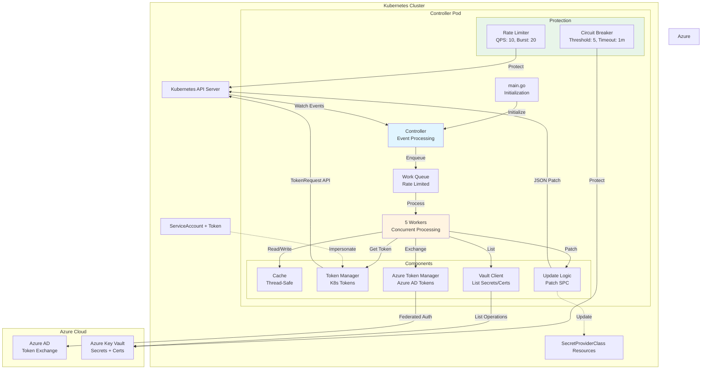
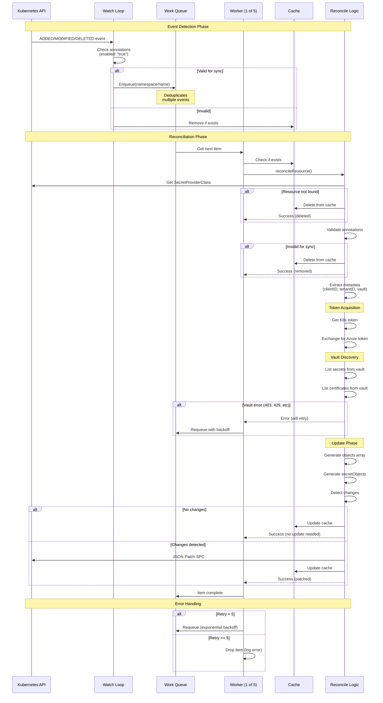
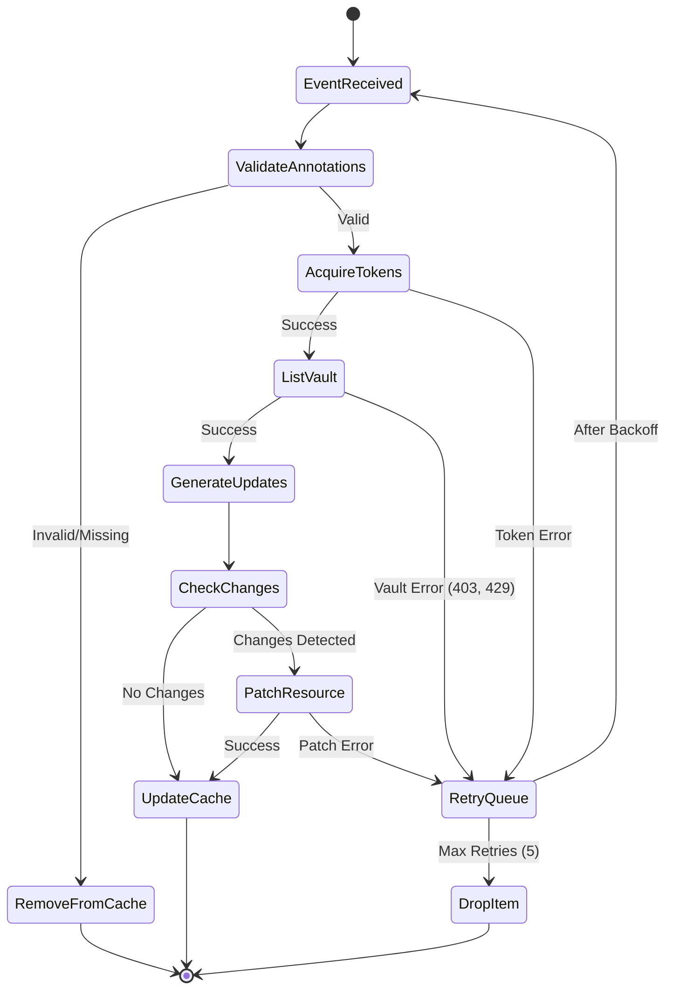
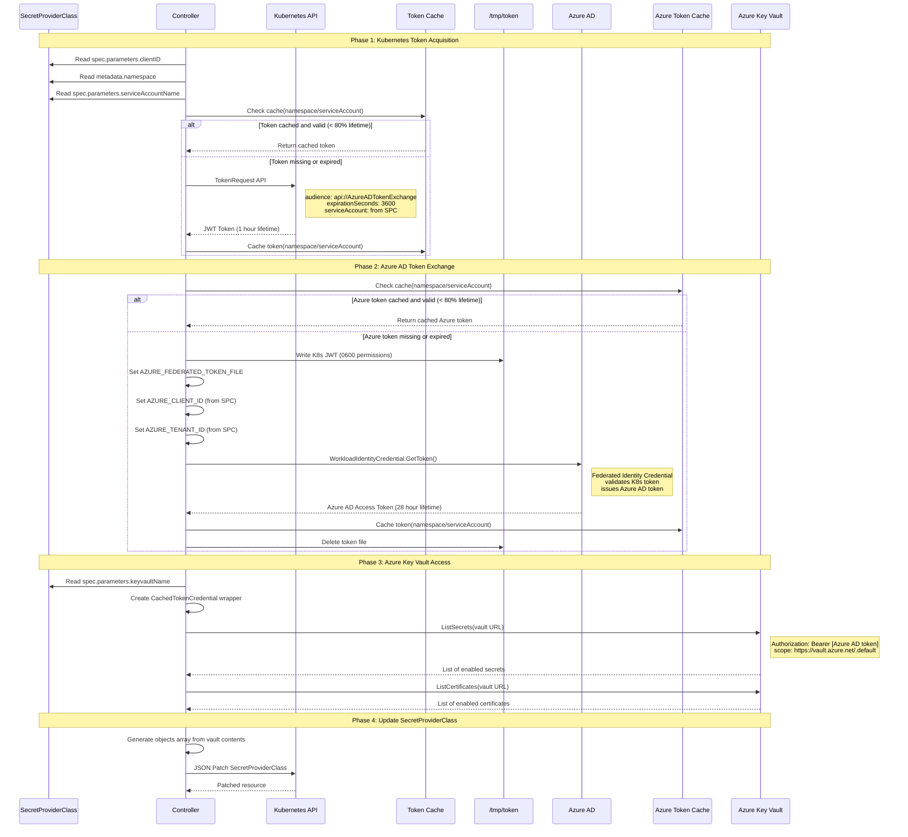
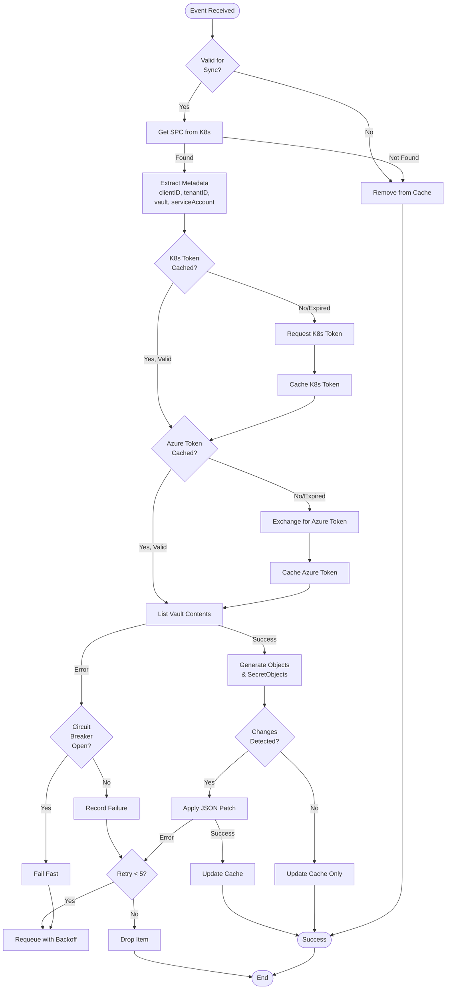

# Azure Key Vault Sync Controller - System Architecture

**Version:** 1.3.x
**Last Updated:** 2025-10-29
**Status:** Production

## Table of Contents

1. [Overview](#overview)
2. [System Design Architecture](#system-design-architecture)
3. [Watch and Remediation Architecture](#watch-and-remediation-architecture)
4. [Authentication Process](#authentication-process)
5. [Component Details](#component-details)
6. [Data Flow](#data-flow)
7. [Error Handling and Resilience](#error-handling-and-resilience)

---

## Overview

The Azure Key Vault Sync Controller is a Kubernetes operator that automatically synchronizes Azure Key Vault contents to SecretProviderClass objects. It uses Azure Workload Identity federation to authenticate and maintains the vault as the single source of truth for secrets and certificates.

**Key Principles:**
- Event-driven reconciliation with work queue pattern
- Vault is always the source of truth
- Service account impersonation for least privilege
- Graceful error handling and retry logic
- Rate limiting and circuit breakers for API protection

---

## System Design Architecture



### Architecture Layers

**Layer 1: Kubernetes Integration**
- Watches SecretProviderClass resources across all namespaces (or single namespace)
- Uses Kubernetes Dynamic Client for custom resource handling
- Rate-limited API access (10 QPS, 20 burst)

**Layer 2: Event Processing**
- Work queue with exponential backoff retry logic
- 5 concurrent worker goroutines for parallel processing
- Event deduplication (multiple events → single reconciliation)

**Layer 3: Business Logic**
- Thread-safe cache for SecretProviderClass state
- Token management with automatic renewal (80% lifetime)
- Vault integration with circuit breaker protection
- JSON Patch updates with change detection

**Layer 4: External Integration**
- Azure Workload Identity federation for authentication
- Azure Key Vault SDK for vault operations
- Automatic retry with Retry-After header respect (429 handling)

---

## Watch and Remediation Architecture



### Watch Mechanism

**Event Sources:**
1. **Watch Stream** - Real-time event notifications (ADDED, MODIFIED, DELETED)
2. **Periodic Resync** - Every 5 minutes, reprocess all cached items

**Event Filtering:**
- Only processes SecretProviderClass with `azure-keyvault-sync/enabled: "true"`
- Validates `azure-keyvault-sync/service-account` annotation present
- Ignores resources without required annotations

**Work Queue Behavior:**
- **Deduplication:** Multiple events for same resource → single reconciliation
- **Rate Limiting:** Maximum 5 concurrent reconciliations
- **Retry Logic:** Exponential backoff (1s, 2s, 4s, 8s, 16s)
- **Max Retries:** 5 attempts before dropping item

### Reconciliation States



---

## Authentication Process



### Authentication Flow Details

**Phase 1: Kubernetes Token Acquisition (Service Account Impersonation)**

1. **Extract Metadata** from SecretProviderClass:
   - `spec.parameters.clientID` → Azure Managed Identity Client ID
   - `metadata.namespace` → Kubernetes namespace
   - `spec.parameters.serviceAccountName` → Target service account

2. **Request Token** via Kubernetes TokenRequest API:
   ```go
   TokenRequest{
       Spec: {
           Audiences: ["api://AzureADTokenExchange"],
           ExpirationSeconds: 3600,  // 1 hour
       }
   }
   ```

3. **Cache Token** by `namespace/serviceAccount` key
4. **Renew at 80%** of lifetime (48 minutes)

**Phase 2: Azure AD Token Exchange (Workload Identity Federation)**

1. **Write K8s JWT** to temporary file with restricted permissions (0600)
2. **Set Environment Variables:**
   - `AZURE_FEDERATED_TOKEN_FILE=/tmp/token-xxxxx`
   - `AZURE_CLIENT_ID=<from SPC>`
   - `AZURE_TENANT_ID=<from SPC>`

3. **Create WorkloadIdentityCredential:**
   ```go
   cred, err := azidentity.NewWorkloadIdentityCredential(&azidentity.WorkloadIdentityCredentialOptions{
       ClientID:      clientID,
       TenantID:      tenantID,
       TokenFilePath: tokenFile,
   })
   ```

4. **Exchange for Azure Token:**
   ```go
   token, err := cred.GetToken(ctx, policy.TokenRequestOptions{
       Scopes: []string{"https://vault.azure.net/.default"},
   })
   ```

5. **Cache Azure Token** by `namespace/serviceAccount` key
6. **Renew at 80%** of lifetime (22.4 hours for 28-hour token)
7. **Clean up** temporary token file

**Phase 3: Azure Key Vault Access**

1. **Create Custom Credential Wrapper:**
   ```go
   type CachedTokenCredential struct {
       token      string
       expiration time.Time
   }
   ```

2. **Use Azure SDK:**
   ```go
   secretClient, err := azsecrets.NewClient(vaultURL, credential, nil)
   certClient, err := azcertificates.NewClient(vaultURL, credential, nil)
   ```

3. **List Vault Contents:**
   - Filter for enabled secrets only
   - Filter for enabled certificates only
   - Handle pagination for large vaults

**Phase 4: Update SecretProviderClass**

1. **Generate YAML** objects array from vault contents
2. **Detect Changes** (compare with cached version)
3. **Apply JSON Patch** if changes detected:
   ```json
   [
     {
       "op": "replace",
       "path": "/spec/parameters/objects",
       "value": "array:\n  - objectName: secret1\n    ..."
     }
   ]
   ```

### Token Lifecycle

```mermaid
gantt
    title Token Renewal Timeline
    dateFormat HH:mm
    axisFormat %H:%M

    section K8s Token
    Valid (60min)           :done, k8s1, 00:00, 60m
    Renew at 48min         :crit, k8s2, 00:48, 1m
    New Token Valid        :active, k8s3, 00:49, 60m

    section Azure Token
    Valid (28hr)           :done, az1, 00:00, 1680m
    Renew at 22.4hr       :crit, az2, 22:24, 1m
    New Token Valid       :active, az3, 22:25, 1680m
```



**Renewal Thresholds:**
- **Kubernetes Token:** Renew at 80% of 3600s = 2880s (48 minutes)
- **Azure Token:** Renew at 80% of 28 hours = 22.4 hours

---

## Component Details

### 1. Controller (internal/controller/controller.go)

**Responsibilities:**
- Watches SecretProviderClass resources
- Manages work queue and worker goroutines
- Handles event routing (ADDED, MODIFIED, DELETED)
- Coordinates reconciliation process

**Key Methods:**
- `Run()` - Start watch loop and workers
- `handleAdded()` - Process new resources
- `handleModified()` - Handle updates
- `handleDeleted()` - Remove from cache
- `reconcileResource()` - Core reconciliation logic
- `processNextItem()` - Worker loop

### 2. Cache (internal/cache/cache.go)

**Responsibilities:**
- Thread-safe in-memory storage
- SecretProviderClass state management
- Fast lookups by namespace/name

**Key Methods:**
- `Set(namespace, name, obj)` - Store resource
- `Get(namespace, name)` - Retrieve resource
- `Has(namespace, name)` - Check existence
- `Delete(namespace, name)` - Remove resource
- `List()` - Get all cached resources

**Thread Safety:**
- Uses `sync.RWMutex` for concurrent access
- Read lock for queries (Has, Get, List)
- Write lock for modifications (Set, Delete)

### 3. Token Manager (internal/token/token.go)

**Responsibilities:**
- Kubernetes ServiceAccount token acquisition
- Token caching and renewal
- Service account impersonation

**Key Methods:**
- `GetToken(namespace, serviceAccount, clientID)` - Acquire or return cached token
- Cache key: `namespace/serviceAccount`
- Automatic renewal at 80% lifetime

### 4. Azure Token Manager (internal/azure/azure.go)

**Responsibilities:**
- Azure AD token exchange via Workload Identity
- Azure token caching and renewal
- Temporary file management for federation

**Key Methods:**
- `GetToken(namespace, serviceAccount, clientID, tenantID, k8sToken)` - Exchange token
- Cache key: `namespace/serviceAccount`
- Automatic renewal at 80% lifetime

### 5. Vault Client (internal/azure/vault.go)

**Responsibilities:**
- Azure Key Vault SDK integration
- List secrets and certificates
- Pagination handling

**Key Methods:**
- `ListSecrets(vaultURL, token, expiration)` - Get all enabled secrets
- `ListCertificates(vaultURL, token, expiration)` - Get all enabled certificates
- Returns arrays of secret/cert names

### 6. Update Logic (internal/update/update.go)

**Responsibilities:**
- Generate SecretProviderClass objects array
- Generate secretObjects for Kubernetes Secrets
- Detect changes and apply JSON Patch

**Key Methods:**
- `GenerateObjectsFromVault(secrets, certs)` - Create YAML objects array
- `GenerateSecretObjectsFromVault(secrets, certs, annotations)` - Create secretObjects
- `PatchSecretProviderClass(client, resource, newObjects, newSecretObjects)` - Apply updates
- `DetectChanges(old, new)` - Compare with normalization

### 7. Circuit Breaker (internal/circuitbreaker/circuitbreaker.go)

**Responsibilities:**
- Protect Azure Key Vault from cascading failures
- Fail fast when vault is unavailable
- Automatic recovery testing

**States:**
- **Closed:** Normal operation, requests pass through
- **Open:** Failures exceeded threshold (5), all requests fail immediately
- **Half-Open:** Testing if service recovered after timeout (1 minute)

**Configuration:**
- Threshold: 5 consecutive failures
- Timeout: 1 minute before testing recovery
- Automatic state transitions

### 8. Config (internal/config/config.go)

**Responsibilities:**
- Environment variable loading
- Configuration validation
- Default values

**Validates:**
- All environment variables against allowed ranges
- Exits immediately on invalid configuration
- Provides clear error messages

---

## Data Flow

### Complete Reconciliation Flow



---

## Error Handling and Resilience

### Rate Limiting

**Kubernetes API Rate Limiting:**
```go
Config: {
    QPS:   10.0,  // Sustained rate
    Burst: 20,    // Temporary spike allowance
}
```

**Purpose:**
- Prevents controller from overwhelming Kubernetes API server
- Allows temporary bursts for efficient batch operations
- Smooths out request distribution

### Circuit Breaker

**Azure Key Vault Circuit Breaker:**
```go
Config: {
    Threshold: 5,              // Consecutive failures before opening
    Timeout:   1 * time.Minute, // Wait before testing recovery
}
```

**State Transitions:**
1. **Closed → Open:** After 5 consecutive failures
2. **Open → Half-Open:** After 1 minute timeout
3. **Half-Open → Closed:** On successful request
4. **Half-Open → Open:** On failure (need 5 more failures to reopen)

**Benefits:**
- Prevents cascading failures
- Gives Azure Key Vault time to recover
- Logs clear error messages with retry timing

### Retry Logic

**Work Queue Retry:**
- Exponential backoff: 1s, 2s, 4s, 8s, 16s
- Maximum 5 retries per item
- Items dropped after max retries (logged as errors)

**Azure 429 Handling:**
- Automatically extracts `Retry-After` header
- Waits specified duration before retry
- Logs throttling events for monitoring

### Graceful Degradation

**Vault Permission Errors (403):**
- Does not clear existing SecretProviderClass objects
- Triggers retry logic (5 attempts)
- After max retries, preserves existing state
- Logs clear permission error messages

**Network Errors:**
- Transient errors trigger retry with backoff
- Circuit breaker prevents resource exhaustion
- Failed resources don't block other resources

---

## Security Considerations

### Least Privilege

**RBAC Permissions:**
- Namespace-scoped: Role limited to single namespace
- Cluster-wide: ClusterRole with full access
- Token creation: Limited to ServiceAccount impersonation
- SPC updates: Only JSON Patch operations

**Service Account Impersonation:**
- Controller doesn't use its own identity for vault access
- Impersonates workload's ServiceAccount
- Maintains audit attribution to actual workload
- Reduces blast radius of compromised controller

### Token Security

**Kubernetes Tokens:**
- Short lifetime (1 hour)
- Audience-restricted: `api://AzureADTokenExchange`
- Automatic renewal before expiration
- Logged as snippets only (first 5 + last 5 chars)

**Azure Tokens:**
- Temporary files with 0600 permissions
- Automatic cleanup with defer
- Cached in memory only
- Never persisted to disk (except temp file during exchange)

### Pod Security

**Pod Security Standards (PSS) Restricted-Compliant:**
- Non-root user (UID 65534)
- Read-only root filesystem (with /tmp emptyDir)
- All capabilities dropped
- No privilege escalation
- Seccomp profile enabled (RuntimeDefault)

---

## Performance Characteristics

### Scalability

**Resource Capacity:**
- Tested with 100+ SecretProviderClass resources
- 5 concurrent workers handle parallel processing
- Work queue deduplication prevents redundant reconciliations
- Token caching reduces API calls by 90%+

**Memory Usage:**
- In-memory cache: ~1KB per cached SecretProviderClass
- Token cache: ~10KB per unique namespace/serviceAccount
- Typical memory footprint: < 50MB for 100 resources

**API Call Reduction:**
```
Without caching: 100 resources × 5 min resync = 20 calls/min to K8s + Azure
With caching:    100 resources × 5 min resync = 2 calls/min average
Reduction:       90% fewer API calls
```

### Latency

**Event-to-Reconciliation:**
- Watch events: < 1 second to enqueue
- Queue processing: Immediate (no artificial delays)
- Reconciliation: 2-5 seconds per resource (with cached tokens)
- Total latency: < 10 seconds from vault change to SPC update

**Token Operations:**
- K8s token request: 50-200ms
- Azure token exchange: 200-500ms
- Cached token retrieval: < 1ms

---

## Monitoring and Observability

### Logging

**Log Levels:**
- **DEBUG:** Detailed token info, cache operations, state transitions
- **INFO:** Reconciliation success, token renewals, vault discoveries
- **WARN:** Circuit breaker opens, retry attempts, rate limit hits
- **ERROR:** Vault errors, patch failures, authentication failures

**Structured Logging:**
```json
{
  "level": "info",
  "msg": "Generated objects from vault",
  "namespace": "default",
  "name": "my-spc",
  "totalObjects": 15,
  "secrets": 10,
  "certificates": 5
}
```

### Metrics (Future Enhancement)

**Proposed Metrics:**
- `reconcile_duration_seconds` - Histogram of reconciliation time
- `reconcile_total` - Counter of reconciliation attempts by result
- `token_cache_hits` - Counter of cache hits vs misses
- `circuit_breaker_state` - Gauge of current circuit breaker state
- `vault_operations_total` - Counter of vault API calls by operation

---

## Related Documents

- [Security Analysis](security-analysis.md) - Detailed security assessment
- [Rate Limiting Design](rate-limiting.md) - Deep dive on rate limiting
- [Testing Guide](../../README.md#testing) - How to run tests
- [Configuration Reference](../../README.md#configuration) - All config options
