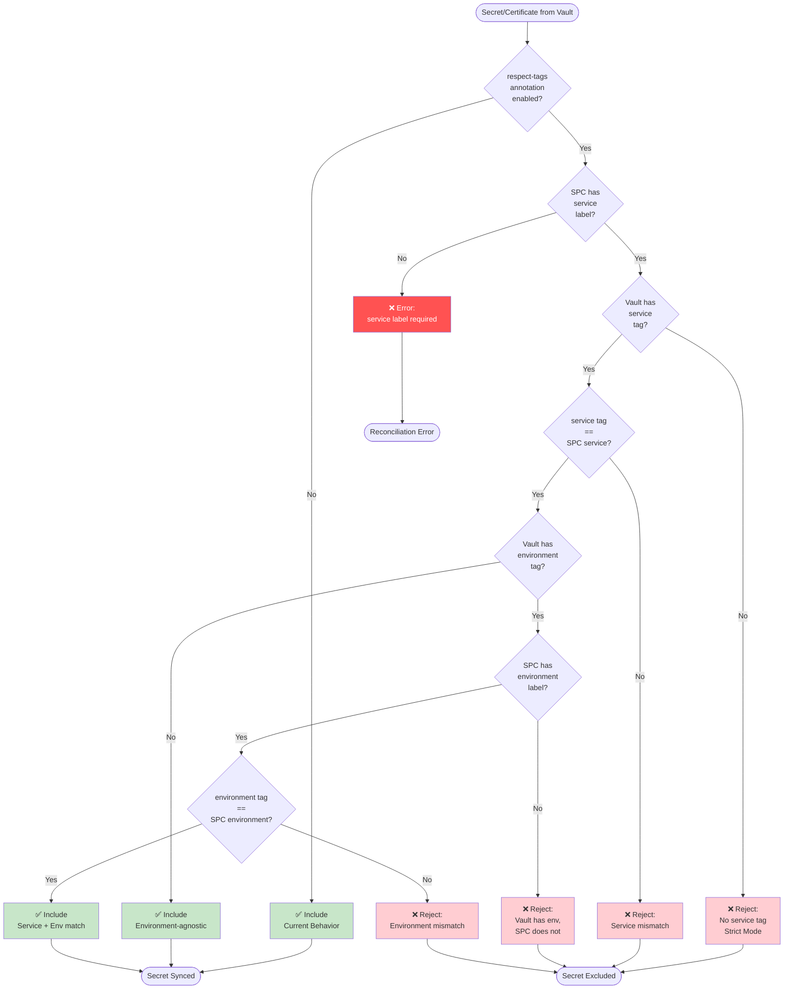

# Tag Filtering Decision Tree

**Date:** 2025-10-29
**Status:** Approved for Implementation
**Feature:** Azure Key Vault Tag-Based Secret Filtering

---

## Overview

This document defines the tag filtering logic for selectively synchronizing secrets and certificates from Azure Key Vault based on their tags. Tag filtering is **opt-in** via annotation and uses SecretProviderClass labels to match against vault resource tags.

Azure Key Vault is the **source of truth** for all configuration, including both filtering rules and Kubernetes Secret generation.

### Supported Vault Tags

1. **`service`** - Required for tag filtering; matches against SPC `service` label
2. **`environment`** - Optional for environment separation; matches against SPC `environment` label
3. **`secret-object`** - Must be exactly `"true"` to generate a Kubernetes Secret (type: Opaque)
4. **`cert-object`** - Must be exactly `"true"` to generate a Kubernetes Secret (type: kubernetes.io/tls)

### Key Principles

1. **Default Behavior:** Sync all enabled secrets (backward compatible)
2. **Opt-In Filtering:** Enable via `azure-keyvault-sync/respect-tags: "true"` annotation
3. **Kubernetes-Native:** Use SPC labels (not annotations) for matching
4. **Strict Mode:** Reject secrets without service tag when filtering enabled
5. **Environment Optional:** Environment-agnostic secrets allowed (service tag only)
6. **Vault as Source of Truth:** Azure Key Vault tags control all behavior, including Kubernetes Secret generation

---

## Visual Decision Flow



---

## Truth Table

| respect-tags | SPC service | SPC env | Vault service | Vault env | Result | Reason |
|--------------|-------------|---------|---------------|-----------|--------|--------|
| `false` | any | any | any | any | ✅ Include | Default: sync all |
| `true` | missing | any | any | any | ❌ Error | service label required |
| `true` | `web-api` | any | missing | any | ❌ Reject | Vault must have service tag |
| `true` | `web-api` | any | `mobile-api` | any | ❌ Reject | Service mismatch |
| `true` | `web-api` | missing | `web-api` | `production` | ❌ Reject | Vault has env, SPC doesn't |
| `true` | `web-api` | `production` | `web-api` | `staging` | ❌ Reject | Environment mismatch |
| `true` | `web-api` | missing | `web-api` | missing | ✅ Include | Service match, no env |
| `true` | `web-api` | `production` | `web-api` | missing | ✅ Include | Service match, env-agnostic secret |
| `true` | `web-api` | `production` | `web-api` | `production` | ✅ Include | Both match |

---

## Configuration Examples

### SecretProviderClass Configuration

```yaml
apiVersion: secrets-store.csi.x-k8s.io/v1
kind: SecretProviderClass
metadata:
  name: web-api-secrets
  namespace: production
  labels:
    service: web-api          # Required when respect-tags enabled
    environment: production    # Optional (allows env-agnostic secrets if omitted)
  annotations:
    azure-keyvault-sync/service-account: "web-api"
    azure-keyvault-sync/respect-tags: "true"  # Enable tag filtering
spec:
  provider: azure
  parameters:
    clientID: "aac3d546-358f-4e74-94e5-bb4c472d7cc0"
    keyvaultName: "my-vault"
    tenantId: "72f988bf-86f1-41af-91ab-2d7cd011db47"
```

### Azure Key Vault Secret Tags

```json
{
  "database-password": {
    "tags": {
      "service": "web-api",
      "environment": "production",
      "secret-object": "true"    // Generate K8s Secret
    }
  },
  "api-key": {
    "tags": {
      "service": "web-api"
      // No environment tag - shared across all environments
      // No secret-object tag - not generated as K8s Secret
    }
  },
  "tls-certificate": {
    "tags": {
      "service": "web-api",
      "environment": "production",
      "cert-object": "true"      // Generate K8s TLS Secret
    }
  },
  "mobile-secret": {
    "tags": {
      "service": "mobile-api",
      "environment": "production"
    }
  },
  "legacy-secret": {
    "tags": {}
    // No tags - rejected when filtering enabled
  }
}
```

---

## Scenarios

### Scenario 1: Default Behavior (No Filtering)

**SecretProviderClass:**
```yaml
metadata:
  name: web-api-secrets
  namespace: production
  labels:
    service: web-api
annotations:
  azure-keyvault-sync/service-account: "web-api"
  # respect-tags NOT enabled
```

**Vault Secrets:**
```
database-password (tags: {service: "web-api", environment: "production"})
api-key (tags: {service: "mobile-api", environment: "production"})
shared-cert (no tags)
```

**Result:**
- ✅ database-password → Included
- ✅ api-key → Included (even though service mismatch)
- ✅ shared-cert → Included

**Logic:** All enabled secrets synced (current behavior)

---

### Scenario 2: Service-Only Filtering

**SecretProviderClass:**
```yaml
metadata:
  name: web-api-secrets
  labels:
    service: web-api
    # No environment label
annotations:
  azure-keyvault-sync/service-account: "web-api"
  azure-keyvault-sync/respect-tags: "true"
```

**Vault Secrets:**
```
database-password (tags: {service: "web-api"})
api-key (tags: {service: "mobile-api"})
shared-cert (no tags)
admin-password (tags: {service: "web-api", environment: "production"})
```

**Result:**
- ✅ database-password → Included (service match, no env)
- ❌ api-key → Rejected (service mismatch)
- ❌ shared-cert → Rejected (no service tag)
- ✅ admin-password → Included (service match, env-agnostic secret)

**Logic:** Service must match, environment is ignored (vault env treated as optional)

---

### Scenario 3: Service + Environment Filtering

**SecretProviderClass:**
```yaml
metadata:
  name: web-api-secrets
  labels:
    service: web-api
    environment: production
annotations:
  azure-keyvault-sync/service-account: "web-api"
  azure-keyvault-sync/respect-tags: "true"
```

**Vault Secrets:**
```
prod-db-password (tags: {service: "web-api", environment: "production"})
staging-db-password (tags: {service: "web-api", environment: "staging"})
shared-api-key (tags: {service: "web-api"})
mobile-secret (tags: {service: "mobile-api", environment: "production"})
```

**Result:**
- ✅ prod-db-password → Included (both match)
- ❌ staging-db-password → Rejected (env mismatch)
- ✅ shared-api-key → Included (service match, env-agnostic)
- ❌ mobile-secret → Rejected (service mismatch)

**Logic:** Service must match, environment must match if present in vault

---

### Scenario 4: Multi-Service Vault Sharing

**Vault has secrets for multiple services:**
```
web-api-db (tags: {service: "web-api", environment: "production"})
mobile-api-db (tags: {service: "mobile-api", environment: "production"})
shared-redis (tags: {service: "shared", environment: "production"})
```

**Web API SecretProviderClass:**
```yaml
metadata:
  labels:
    service: web-api
    environment: production
annotations:
  azure-keyvault-sync/respect-tags: "true"
```

**Web API Result:**
- ✅ web-api-db → Included
- ❌ mobile-api-db → Rejected (different service)
- ❌ shared-redis → Rejected (different service)

**Mobile API SecretProviderClass:**
```yaml
metadata:
  labels:
    service: mobile-api
    environment: production
annotations:
  azure-keyvault-sync/respect-tags: "true"
```

**Mobile API Result:**
- ❌ web-api-db → Rejected (different service)
- ✅ mobile-api-db → Included
- ❌ shared-redis → Rejected (different service)

**Key Insight:** Each service sees only its own secrets from shared vault

---

### Scenario 5: Environment Separation

**Same service, different environments:**

**Production SPC:**
```yaml
metadata:
  labels:
    service: web-api
    environment: production
annotations:
  azure-keyvault-sync/respect-tags: "true"
```

**Staging SPC:**
```yaml
metadata:
  labels:
    service: web-api
    environment: staging
annotations:
  azure-keyvault-sync/respect-tags: "true"
```

**Vault Secrets:**
```
db-password (tags: {service: "web-api", environment: "production"})
db-password-staging (tags: {service: "web-api", environment: "staging"})
api-key (tags: {service: "web-api"})  # No environment - shared
```

**Production Result:**
- ✅ db-password → Included (prod env)
- ❌ db-password-staging → Rejected (staging env)
- ✅ api-key → Included (env-agnostic)

**Staging Result:**
- ❌ db-password → Rejected (prod env)
- ✅ db-password-staging → Included (staging env)
- ✅ api-key → Included (env-agnostic)

**Key Insight:** Environment-tagged secrets isolated, untagged secrets shared

---

### Scenario 6: Kubernetes Secret Generation via Vault Tags

**Overview:** Vault tags control whether secrets/certificates are automatically synced as Kubernetes Secrets. This is independent of tag filtering but works together with it.

**Important:** Tag filtering runs FIRST, then secret-object evaluation. Only secrets that pass tag filtering (or when filtering is disabled) are evaluated for Kubernetes Secret generation.

#### Sub-scenario 6A: Basic Secret Generation (No Filtering)

**SecretProviderClass:**
```yaml
metadata:
  name: web-api-secrets
  labels:
    service: web-api
annotations:
  azure-keyvault-sync/service-account: "web-api"
  # respect-tags NOT enabled (filtering disabled)
```

**Vault Secrets:**
```
database-password (tags: {secret-object: "true"})
api-key (tags: {secret-object: "false"})
redis-password (no tags)
```

**Result:**
- ✅ database-password → In objects array AND generated as K8s Secret (secret-object=true)
- ✅ api-key → In objects array only (secret-object=false)
- ✅ redis-password → In objects array only (no secret-object tag)

**Logic:** All secrets included (no filtering), only secret-object=true generates K8s Secret

---

#### Sub-scenario 6B: Combined Filtering + Secret Generation

**SecretProviderClass:**
```yaml
metadata:
  name: web-api-secrets
  labels:
    service: web-api
    environment: production
annotations:
  azure-keyvault-sync/service-account: "web-api"
  azure-keyvault-sync/respect-tags: "true"
```

**Vault Secrets:**
```
db-password (tags: {service: "web-api", environment: "production", secret-object: "true"})
api-key (tags: {service: "web-api", secret-object: "true"})
staging-secret (tags: {service: "web-api", environment: "staging", secret-object: "true"})
mobile-secret (tags: {service: "mobile-api", secret-object: "true"})
```

**Result:**
- ✅ db-password → Passes filtering (service+env match) → Generated as K8s Secret (secret-object=true)
- ✅ api-key → Passes filtering (service match, env-agnostic) → Generated as K8s Secret (secret-object=true)
- ❌ staging-secret → Rejected by filtering (env mismatch) → NOT evaluated for secret-object
- ❌ mobile-secret → Rejected by filtering (service mismatch) → NOT evaluated for secret-object

**Key Insight:** Tag filtering is the first gate. Secret-object tags are only evaluated for secrets that pass filtering.

---

#### Sub-scenario 6C: Certificate Secret Generation

**SecretProviderClass:**
```yaml
metadata:
  name: web-api-secrets
  labels:
    service: web-api
annotations:
  azure-keyvault-sync/service-account: "web-api"
  azure-keyvault-sync/respect-tags: "true"
```

**Vault Certificates:**
```
tls-cert (tags: {service: "web-api", cert-object: "true"})
ca-cert (tags: {service: "web-api"})  # No cert-object tag
```

**Result:**
- ✅ tls-cert → Passes filtering → Generated as K8s TLS Secret (type: kubernetes.io/tls)
  - Keys: `tls.key` and `tls.crt`
- ✅ ca-cert → Passes filtering → In objects array only (no cert-object tag)

**Key Insight:** cert-object=true generates kubernetes.io/tls type Secrets with standard TLS key names

---

#### Sub-scenario 6D: Strict Tag Value Requirements

**Vault Secrets:**
```
secret1 (tags: {service: "web-api", secret-object: "true"})   # ✅ Works
secret2 (tags: {service: "web-api", secret-object: "True"})   # ❌ Capitalized - doesn't work
secret3 (tags: {service: "web-api", secret-object: "1"})      # ❌ Numeric - doesn't work
secret4 (tags: {service: "web-api", secret-object: "yes"})    # ❌ Wrong value - doesn't work
secret5 (tags: {service: "web-api", secret-object: ""})       # ❌ Empty - doesn't work
```

**SecretProviderClass:**
```yaml
metadata:
  labels:
    service: web-api
annotations:
  azure-keyvault-sync/respect-tags: "true"
```

**Result:**
- ✅ secret1 → Generated as K8s Secret (exact value "true")
- ✅ secret2-5 → In objects array only (NOT generated as K8s Secrets)

**Key Insight:** Only lowercase string "true" works. Anything else (false, True, 1, yes, empty, nil) is treated as opt-out.

---

#### Sub-scenario 6E: Mixed Secrets and Certificates

**Vault Configuration:**
```
db-password (secret, tags: {service: "web-api", secret-object: "true"})
tls-cert (certificate, tags: {service: "web-api", cert-object: "true"})
api-key (secret, tags: {service: "web-api"})
ca-cert (certificate, tags: {service: "web-api"})
```

**SecretProviderClass:**
```yaml
metadata:
  labels:
    service: web-api
annotations:
  azure-keyvault-sync/respect-tags: "true"
```

**Result - objects array:**
```yaml
spec:
  parameters:
    objects: |
      array:
        - |
          objectName: api-key
          objectType: secret
          objectVersion: ""
        - |
          objectName: ca-cert
          objectType: cert
          objectVersion: ""
        - |
          objectName: db-password
          objectType: secret
          objectVersion: ""
        - |
          objectName: tls-cert
          objectType: cert
          objectVersion: ""
```

**Result - secretObjects:**
```yaml
spec:
  secretObjects:
  - secretName: db-password
    type: Opaque
    data:
    - key: db-password
      objectName: db-password
  - secretName: tls-cert
    type: kubernetes.io/tls
    data:
    - key: tls.key
      objectName: tls-cert
    - key: tls.crt
      objectName: tls-cert
```

**Key Insight:**
- All 4 items appear in objects array (passed filtering)
- Only 2 appear in secretObjects (only those with secret-object/cert-object=true)
- Secrets and certificates have different K8s Secret types

---

#### Implementation Flow

1. **List all secrets/certificates from vault** (with tags)
2. **Apply tag filtering** (if respect-tags enabled)
   - Filter by service tag (required)
   - Filter by environment tag (if present)
   - Result: Filtered list of vault items
3. **Generate objects array** from filtered list
4. **Generate secretObjects array**
   - Only from filtered list
   - Only where secret-object="true" or cert-object="true"
5. **Compare with current SPC state** (intention-based reconciliation)
6. **Patch SPC if changed** (remediation)

**Guarantees:**
- Removing a secret from vault → Removed from SPC
- Changing secret-object from "true" to anything else → Removed from secretObjects
- Changing service tag to mismatch → Secret removed entirely
- Adding secret-object="true" to existing secret → Added to secretObjects

---

## Edge Cases

### Edge Case 1: Empty String Tags
```
Vault secret tags: {service: "", environment: "production"}
SPC labels: {service: "web-api", environment: "production"}
Result: ❌ Reject (empty string != "web-api")
```

### Edge Case 2: Case Sensitivity
```
Vault tags: {Service: "web-api"}  # Capital S
SPC labels: {service: "web-api"}   # Lowercase s
Result: ✅ Include (tag matching is case-insensitive)
```

**Implementation:** Tag keys and values are normalized to lowercase for comparison

### Edge Case 3: Extra Tags
```
Vault tags: {service: "web-api", team: "platform", owner: "john"}
SPC labels: {service: "web-api"}
Result: ✅ Include (extra tags ignored, only service/environment checked)
```

### Edge Case 4: Nil vs Empty Map
```go
// Vault secret with no tags at all
secret.Tags == nil  // or empty map {}

Result: ❌ Reject (no service tag found)
```

### Edge Case 5: Secret-Object Tag Value Strictness
```
Vault secret tags: {secret-object: "true"}   → ✅ K8s Secret generated
Vault secret tags: {secret-object: "True"}   → ❌ NOT generated (case-sensitive)
Vault secret tags: {secret-object: "1"}      → ❌ NOT generated (numeric)
Vault secret tags: {secret-object: "yes"}    → ❌ NOT generated (wrong value)
Vault secret tags: {secret-object: "false"}  → ❌ NOT generated (explicit opt-out)
Vault secret tags: {secret-object: ""}       → ❌ NOT generated (empty string)
Vault secret tags: {secret-object: nil}      → ❌ NOT generated (nil pointer)
Vault secret tags: {}                        → ❌ NOT generated (tag missing)
```

**Implementation:** Only the exact lowercase string `"true"` generates Kubernetes Secrets. All other values are treated as opt-out.

### Edge Case 6: Secret-Object Tag with Filtering Rejection
```
Vault secret tags: {service: "mobile-api", secret-object: "true"}
SPC labels: {service: "web-api"}
SPC annotations: {respect-tags: "true"}

Result: ❌ Rejected by tag filtering → secret-object NOT evaluated
```

**Key Point:** Tag filtering is the first gate. Secret-object/cert-object tags are only evaluated for secrets that pass tag filtering (or when filtering is disabled).

---

## Implementation Reference

### Filter Function Signature

```go
package azure

// MatchesTags evaluates whether a vault secret/certificate should be included
func MatchesTags(vaultTags map[string]*string, config TagFilterConfig) FilterResult

type TagFilterConfig struct {
    RespectTags      bool
    ServiceLabel     string
    EnvironmentLabel string
}

type FilterResult struct {
    Include bool
    Reason  RejectionReason
}

type RejectionReason string

const (
    ReasonIncluded          RejectionReason = "included"
    ReasonNoServiceTag      RejectionReason = "no_service_tag"
    ReasonServiceMismatch   RejectionReason = "service_mismatch"
    ReasonVaultEnvSPCNoEnv  RejectionReason = "vault_env_spc_no_env"
    ReasonEnvMismatch       RejectionReason = "environment_mismatch"
)
```

### Decision Tree Pseudocode

```go
func MatchesTags(vaultTags map[string]*string, config TagFilterConfig) FilterResult {
    // Path 1: respect-tags disabled → Include all
    if !config.RespectTags {
        return FilterResult{Include: true, Reason: ReasonIncluded}
    }

    // Extract and normalize tags
    vaultService := normalizeTag(getTagValue(vaultTags, "service"))
    vaultEnvironment := normalizeTag(getTagValue(vaultTags, "environment"))
    spcService := normalizeTag(config.ServiceLabel)
    spcEnvironment := normalizeTag(config.EnvironmentLabel)

    // Path 2: No service tag in vault → Reject (strict mode)
    if vaultService == "" {
        return FilterResult{Include: false, Reason: ReasonNoServiceTag}
    }

    // Path 3: Service tag mismatch → Reject
    if vaultService != spcService {
        return FilterResult{Include: false, Reason: ReasonServiceMismatch}
    }

    // At this point: service matches

    // Path 4: Service matches, no environment tag in vault → Include
    if vaultEnvironment == "" {
        return FilterResult{Include: true, Reason: ReasonIncluded}
    }

    // At this point: vault has environment tag

    // Path 5: Vault has environment tag but SPC doesn't → Reject
    if spcEnvironment == "" {
        return FilterResult{Include: false, Reason: ReasonVaultEnvSPCNoEnv}
    }

    // Path 6: Environment tag mismatch → Reject
    if vaultEnvironment != spcEnvironment {
        return FilterResult{Include: false, Reason: ReasonEnvMismatch}
    }

    // Path 7: Both service and environment match → Include
    return FilterResult{Include: true, Reason: ReasonIncluded}
}
```

---

## Logging Strategy

### Rejection Logging

When a secret is rejected, log the reason with full context:

```go
if !result.Include {
    slog.Info("Secret rejected by tag filter",
        "secret", secretName,
        "vault", keyvaultName,
        "namespace", namespace,
        "name", spcName,
        "reason", result.Reason,
        "vaultTags", vaultTags,
        "spcService", serviceLabel,
        "spcEnvironment", environmentLabel)
}
```

### Inclusion Logging

When filtering is enabled, log successful matches at debug level:

```go
if result.Include {
    slog.Debug("Secret included",
        "name", secretName,
        "tags", vaultTags)
}
```

### Summary Logging

Log filtering summary after processing all secrets:

```go
slog.Info("Tag filtering complete",
    "namespace", namespace,
    "name", spcName,
    "secretsIncluded", includedCount,
    "secretsRejected", rejectedCount,
    "certsIncluded", certsIncludedCount,
    "certsRejected", certsRejectedCount)
```

---

## Migration Guide

### Enabling Tag Filtering on Existing SPCs

**Step 1: Tag secrets in Azure Key Vault**
```bash
az keyvault secret set-attributes \
  --vault-name my-vault \
  --name database-password \
  --tags service=web-api environment=production
```

**Step 2: Add labels to SecretProviderClass**
```yaml
kubectl label secretproviderclass web-api-secrets \
  service=web-api \
  environment=production
```

**Step 3: Enable tag filtering** (This activates filtering)
```yaml
kubectl annotate secretproviderclass web-api-secrets \
  azure-keyvault-sync/respect-tags=true
```

### Rollback

To disable tag filtering, remove the annotation:
```bash
kubectl annotate secretproviderclass web-api-secrets \
  azure-keyvault-sync/respect-tags-
```

---

## Troubleshooting

### Secret not syncing after enabling tag filtering?

1. Check vault secret has `service` tag:
   ```bash
   az keyvault secret show --vault-name my-vault --name my-secret \
     --query "tags.service" -o tsv
   ```

2. Verify `service` tag matches SPC `service` label:
   ```bash
   kubectl get secretproviderclass my-spc -o jsonpath='{.metadata.labels.service}'
   ```

3. If vault has `environment` tag, ensure SPC has matching `environment` label:
   ```bash
   kubectl get secretproviderclass my-spc -o jsonpath='{.metadata.labels.environment}'
   ```

4. Check controller logs for rejection reason:
   ```bash
   kubectl logs -l app=azure-keyvault-sync-controller | grep "rejected by tag filter"
   ```

### All secrets rejected?

Common causes:
- **Missing service label on SPC** - Add `service` label
- **Missing service tag on vault secrets** - Tag secrets in Azure
- **Case mismatch** - Tag matching is case-insensitive, but verify spelling
- **Whitespace in tags** - Tags are normalized (trimmed), but check for typos

### Secret in objects array but not generating Kubernetes Secret?

This is expected behavior when the vault secret doesn't have `secret-object="true"` or `cert-object="true"` tag.

1. Check vault secret has the tag:
   ```bash
   az keyvault secret show --vault-name my-vault --name my-secret \
     --query "tags.\"secret-object\"" -o tsv
   ```

2. Verify the tag value is exactly `"true"` (lowercase):
   ```bash
   # Should output: true
   # NOT: True, 1, yes, or anything else
   ```

3. For certificates, check `cert-object` tag:
   ```bash
   az keyvault certificate show --vault-name my-vault --name my-cert \
     --query "tags.\"cert-object\"" -o tsv
   ```

**Key Points:**
- Secrets in the `objects` array will be synced to the CSI volume mount
- Only secrets with `secret-object="true"` or `cert-object="true"` are ALSO created as standalone Kubernetes Secrets
- The value must be exactly lowercase `"true"` - capitalized or other values don't work

---

## Future Enhancements

### Phase 2: Observability (Planned)

1. **Prometheus Metrics:**
   ```
   azure_keyvault_sync_secrets_evaluated_total
   azure_keyvault_sync_secrets_rejected_total{reason="service_mismatch"}
   ```

2. **Debug Annotation:**
   ```yaml
   azure-keyvault-sync/debug-tag-filtering: "true"
   ```
   Enables verbose per-secret evaluation logging.

3. **Status Conditions:**
   Update SPC status with filtering results:
   ```yaml
   status:
     conditions:
     - type: TagFilteringActive
       status: "True"
       message: "12 secrets matched, 3 rejected"
   ```

### Phase 3: Advanced Features (Future)

1. **Wildcard Support:**
   ```yaml
   labels:
     environment: "*"  # Match any environment
   ```

2. **Validation Webhook:**
   Prevent invalid SPC configurations (respect-tags without service label).

3. **Migration Tooling:**
   CLI tool to dry-run tag filtering against live vault before enabling.

---

## Security Considerations

### Trust Model

- **Azure Key Vault tags are authoritative** - The controller trusts vault tags as source of truth
- **Vault admin can modify tags** - Azure RBAC should restrict tag modification
- **SPC labels are Kubernetes RBAC protected** - Namespace admins control label changes

### Defense in Depth

Tag filtering is **one layer** of access control:
1. **Azure Workload Identity** - ServiceAccount → Azure identity mapping
2. **Azure Key Vault RBAC** - What secrets the identity can access
3. **Tag Filtering** - Which accessed secrets to sync
4. **Kubernetes RBAC** - Who can create/modify SPCs

### Audit Trail

- **Controller logs** - Record all rejection decisions with reasons
- **Azure Key Vault logs** - Track secret access attempts
- **Kubernetes audit logs** - Track SPC modifications

---

## References

### Tag Filtering
- Implementation: `internal/azure/filter.go`
- Tests: `internal/azure/filter_test.go`
- Controller Integration: `internal/controller/controller.go:334-515`

### Secret Generation
- Implementation: `internal/update/update.go:GenerateSecretObjectsFromVault()`
- Helper Function: `internal/update/update.go:hasTag()`
- Tests: `internal/update/update_test.go`
- Controller Integration Tests: `internal/controller/controller_test.go`

### Documentation
- Architecture: `docs/design/architecture.md`
- Security Analysis: `docs/design/security-analysis.md`

---

**Document Version:** 2.0
**Last Updated:** 2025-10-29
**Implementation Status:** ✅ Complete (v1.4.0)
**Vault Tag Control:** ✅ Complete (secret-object/cert-object tags)
